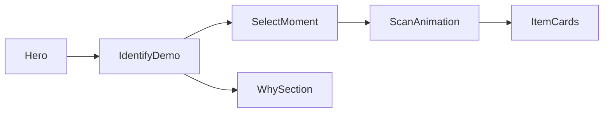

# bae-looks 基本設計 v0.2

> 要件の正: [REQUIREMENTS.md](./REQUIREMENTS.md)  
> ファイル対応: [IMPLEMENTATION.md](./IMPLEMENTATION.md)

## 1. 設計方針

1. **ベイ一人にコンテキストを固定**し、UIの検証速度を上げる  
2. **モックで体験を先に固める**（解析本体は後差し替え）  
3. データ契約（モーメント / アイテム / 確証度）を先に固定し、将来の Agent API にそのまま載せられるようにする  

---

## 2. アーキテクチャ（現行 v0.1）

```
Browser
  └─ Next.js App Router
       ├─ Hero / WhySection …… Server Components
       ├─ IdentifyDemo …… Client Component（選択・スキャン・結果）
       │    └─ ItemCard / ConfidenceBadge
       └─ data/moments.ts …… 静的モック（DEMO_MOMENTS + SITE）
```



### 将来差し替え点

`IdentifyDemo.runIdentify()` 内の `setTimeout` モックを、次の Agent API 呼び出しに置換する。

```
POST /api/identify
  body: { momentId | videoUrl, timestamp, celebrity: "NMIXX Bae", focusCategory? }
  response: DemoMoment 相当（items[] + confidence）
```

---

## 3. 画面構成

| セクション | アンカー | 役割 | 主な要素 |
|------------|----------|------|----------|
| Hero | top | ブランド第一ビュー | `SITE.brand` / tagline / CTA |
| Demo | `#demo` | 特定体験の核 | モーメント3枚・抽象フレーム・スキャン・結果パネル |
| Why | `#why` | スコープ説明 | コンテキスト固定 / UI先検証 / 拡張入口 |
| Footer | — | 免責 | デモ推測であることの明記 |

### Demo 状態機械（`IdentifyDemo`）

| Phase | 意味 | UI |
|-------|------|-----|
| `idle` | 未実行 | 結果パネルに案内文 |
| `scanning` | 解析中（約1.6s） | スキャンライン＋パルス。ボタン disabled |
| `ready` | 結果表示 | `ItemCard` を表示 |

モーメント切替（`selectMoment`）時は `idle` にリセットし、前回結果を破棄する。

---

## 4. データモデル（実装と同一）

型定義の正: [`src/lib/types.ts`](./src/lib/types.ts)  
データの正: [`src/data/moments.ts`](./src/data/moments.ts)

### `DemoMoment`

| フィールド | 型 | 説明 |
|------------|-----|------|
| `id` | string | `stage-silver` / `airport-denim` / `vlog-lip` |
| `title` | string | シーン名 |
| `sourceLabel` | string | ソース表示 |
| `timestamp` | string | 表示用タイムスタンプ |
| `sceneNote` | string | フレームの状況説明 |
| `frameTone` | `stage` \| `airport` \| `vlog` | 抽象フレームの色調 |
| `focusCategory` | `ItemCategory` | 注目カテゴリ |
| `items` | `IdentifiedItem[]` | 候補 |

### `IdentifiedItem`

| フィールド | 型 | 説明 |
|------------|-----|------|
| `category` | `ItemCategory` | カテゴリ |
| `brandName` / `productName` / `modelCandidate` | string | 推測ブランド・商品・型番 |
| `primaryColor` / `materialsTexture` / `distinctiveMarks` | string | 視覚特徴 |
| `confidence` | `exact` \| `same_brand` \| `similar` | 確証度 |
| `confidenceNote` | string | 根拠テキスト |
| `priceHint` | string | 価格目安 |
| `links` | `ShopLink[]` | 購入・検索導線（`kind`: official / mall / similar） |
| `alternatives` | `{ label, priceHint, note }[]` | プチプラ / 概念コーデ |

### 確証度 UI

| 値 | 表示 | 意味 |
|----|------|------|
| `exact` | 完全一致 | 複数手がかりが一致 |
| `same_brand` | 同一ブランド | ブランドまでは有力 |
| `similar` | 類似デザイン | シルエット近似 |

### サイト定数 `SITE`

| キー | 例 |
|------|-----|
| `brand` | `BAE FRAME` |
| `member` / `memberJa` | `NMIXX Bae` / `NMIXX ベイ` |
| `tagline` | ヒーローキャッチ |
| `support` | ヒーロー補足文 |

---

## 5. Agent 入出力契約（v0.2 以降用）

v0.1 はモックで同一スキーマを返す。本番接続時もこの形を維持する。

### Input

| 区分 | 例 |
|------|-----|
| メディア | 動画URL、タイムスタンプ、キーフレーム、ユーザー切り抜き |
| コンテキスト | 出演者=`NMIXX Bae`（固定）、番組/配信タイトル、投稿日時、タイアップ表記 |
| ユーザー希望 | 完全一致のみ / 類似可 / 予算上限 / 国内即納 / カテゴリ絞り込み |

### Agent Steps（将来）

1. メディア前処理・フレーム抽出  
2. 物体検出・セグメンテーション（服・アクセ・コスメ）  
3. マルチモーダル解析＋ベイの着用傾向・ファン特定ログの照合  
4. EC・Web横断検索  
5. 確証度スコアリングと根拠付与  

### Output（ユーザー向け）

- アイテム情報（ブランド、商品名、型番候補、定価目安）  
- 購入導線（公式 / モール / 類似）  
- 推し活拡張（シーン説明、代替・概念コーデ）  
- 確証度の可視化（バッジ＋ `confidenceNote`）  

中間JSON（特徴言語化）は鑑定プロンプトの  
`visual_features` / `candidate_brands` / `search_queries` を想定し、最終的に `IdentifiedItem` へ正規化する。

---

## 6. UI / ビジュアル方針

| 項目 | 方針 |
|------|------|
| トーン | ダークフィルム調＋シアンアクセント（紫グラデ依存を避ける） |
| フォント | Syne（display）+ Manrope（本文） |
| ヒーロー | フルブリード。ブランド名が第一ビューの主役 |
| カード | 結果・操作のためのコンテナとしてのみ使用（ヒーローにカードを置かない） |
| モーション | rise / scan / pulse-ring / card-enter（`globals.css`） |

---

## 7. 技術スタック

| 層 | 選定 |
|----|------|
| フレームワーク | Next.js 16（App Router）+ React 19 |
| スタイル | Tailwind CSS 4 |
| データ | 静的 TypeScript モジュール（DBなし） |
| 品質 | ESLint（`eslint-config-next`） |

---

## 8. リスクと対策

| リスク | 対策 |
|--------|------|
| デモ商品が実在断定と誤解される | フッター・要件で「UX用デモ推測」と明記 |
| 実AI接続時にUI契約が崩れる | `DemoMoment` / `IdentifiedItem` を API レスポンス契約にする |
| 拡張時にベイ前提コピーが残る | `SITE` と `DEMO_MOMENTS` を差し替え可能な境界に保つ |
