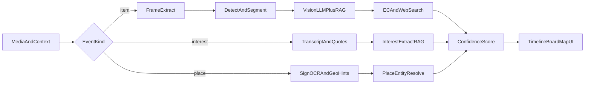

# Oshi Item Finder — 仕様整理ブリーフ

| 項目 | 内容 |
|------|------|
| 作業名（仮） | **Oshi Item Finder**（将来名は「推しコンテキスト可視化」寄りのブランドも検討） |
| 一言 | 動画・発言・行動ログから、推しの「今」をアイテム／興味／場所として見える化する |
| 文書種別 | 新規事業仕様整理（実装コードは含まない） |
| バージョン | v0.2 |

### プロダクト仮説（v0.2で明確化）

推し活ユーザーが本当に欲しいのは「服の型番」だけではない。

| レイヤー | 例 | なぜ価値があるか |
|----------|-----|------------------|
| **物（モノ）** | 服、靴、アクセ、香水、コスメ | 再現・購入・ギフトの起点 |
| **興味（コト）** | 発言で「最近ハマってる」趣味・作品・習慣 | 会話・推し理解・コンテンツ追従 |
| **場所（トコロ）** | 最近行った店・カフェ・スポット | 聖地巡礼・お揃い体験・地図化 |

**可視化のゴール**: 推しごとに「いまのコンテキスト」がタイムライン／マップ／カテゴリボードで俯瞰でき、気になる一点を深掘り（特定・購入・代替）できること。

> 先行UI試作 `bae-looks` は「物（服・アクセ）」の感触検証。感触が良ければ、同じカード／確証度の骨格に **香水・発言由来の興味・店舗** を載せていく。

---

## 0. 推しコンテキストの情報設計（可視化の核）

### 0.1 エンティティ

```text
Celebrity (推し)
  └─ ContextEvent (いつ・どのソースから得られた事実/推測)
        ├─ kind: item | interest | place
        ├─ confidence: exact | same_brand | similar | needs_review
        ├─ evidence: フレーム / 発言テキスト / 投稿URL / タイムスタンプ
        └─ actions: 購入導線 | 類似代替 | 地図 | 関連コンテンツ
```

### 0.2 種別ごとの入力と出力イメージ

| kind | 主なソース | 抽出の手がかり | 画面での見せ方 |
|------|------------|----------------|----------------|
| `item` | 動画フレーム、写真、ライブ | シルエット、ロゴ、ボトル形状（香水） | 確証度付き商品カード＋購入/代替 |
| `interest` | 配信トーク、SNS文言、字幕 | 「最近〜」「ハマってる」「おすすめ」 | 興味チップ／タイムライン（出典付き） |
| `place` | VLOG、ストーリー、位置情報付き投稿 | 店名読み上げ、看板OCR、ハッシュタグ | マップピン＋訪問日＋同行シーン |

### 0.3 可視化UIの候補（フェーズ2以降）

1. **タイムライン**: 日付順に「着た／言った／行った」が混在  
2. **ボード**: 物 / 興味 / 場所の3列カンバン  
3. **マップ**: 行った店だけを地図上にプロット  
4. **ディープリンク**: 1カードを開くと証拠（秒数・引用）と行動（買う・似た店）  

MVPはまず `item`（服・アクセ）でカード体験を固め、次に香水（同じ `item`）、その後 `interest` / `place` を足す。

---

## 1. 類似・競合既存サービスの調査とギャップ分析

### 1.1 競合比較

| サービス名 | アプローチ手法 | 主なターゲット | 強み | 現状のペイン・弱点 |
|------------|----------------|----------------|------|-------------------|
| コレカウ | 有名人衣装の人手/編集DB。タレント名・番組名検索。販売サイトへ誘導 | ドラマ/バラエティ/SNS私服を追う国内ファン | TV衣装協力・ファッションハンターによる特定。無地アイテムにも強い。累計ユーザー規模大 | 任意のYouTube/TikTok/配信の「その秒」リアルタイム特定は弱い。未掲載は質問待ち |
| WEAR | コーデ投稿＋ZOZOTOWN在庫連携の画像/コーデ検索 | 国内ファスト〜ドメスティック志向の一般ユーザー | 数百万点級の正規商品DB直結。在庫・実売価格の即時確認 | 推しコンテキストなし。スクショ工程が残る。有名人の未タグ私服には非特化 |
| LTK（LikeToKnowIt） | クリエイターが商品をタグ付けしたショッパブル投稿/動画 | 海外中心のインフルエンサーフォロワー | 100万ブランド超のタグ基盤。コミッション比較・ショップ統合 | 本人/ブランドがタグした商品のみ。未タグ私服は対象外。国内推し活文脈は薄い |
| YouTube Shopping | クリエイター/ブランドが動画・Shorts・配信に商品タグ | YouTube視聴者・レビュー志向バイヤー | 長尺コンテンツ内のタグ。Merchant Center連携 | タグ必須。日本含む地域制限あり。ファンカム等非公式映像は対象外 |
| TikTok Shop | アプリ内完結の商品タグ＋チェックアウト | 衝動買い・トレンド消費層 | 低摩擦の購入体験。ライブコマース親和性 | タグ済み商品のみ。未開示の私服特定には使えない |
| Google Lens | Web全体の画像照合 | 汎用「これ何？」ユーザー | 柄物・特徴ディテールで高精度。無料・網羅性 | 推しコンテキストなし。一時停止→スクショが必須。無地・暗所・動きで精度低下 |
| ZOZOTOWN 画像検索 | ECモール内の類似商品検索 | 国内ですぐ買いたいユーザー | 掲載ブランド数が多い。購入まで一気通貫 | モール内に閉じる。完全一致より類似寄り。推しのシーン文脈なし |
| 抖音 / 淘宝ライブ系 | ライブ内ネイティブカート＋アフィリ（淘宝客等） | 中国ライブコマース消費者 | 発見→購入がアプリ内完結。高GMV | タグ/カート前提。日本の推し活（未タグファンカム）課題とは別構造 |

### 1.2 既存が満たし切れていない「推し活ユーザー特有の課題」

1. **工程の離脱**: 一時停止 → スクショ → レンズ/画像検索の手数が多い  
2. **動的被写体の失敗**: 斜め・動き・低解像度・スポットライト反射で汎用Lensが外れる  
3. **欲求の二系統**: 「本人完全一致」と「プチプラ概念コーデ」を同時に欲しい  
4. **非公式映像**: 配信・推しカメラ・ファンカムなど、タグも衣装DBもない素材が本体  
5. **コンテキストの分断**: 服は画像検索、発言は配信アーカイブ、お店はファンまとめ…と情報が散らばり、「推しの今」が一覧できない  
6. **物以外の空白**: 香水・最近ハマっていること・行った店は、衣装DB系にもショッパブルタグにも載りにくい  

### 1.3 新規参入の勝ち筋（差別化）

**任意動画の任意秒／任意発言**から、出演者コンテキスト＋ファン集合知＋マルチフレーム／テキスト照合で、未タグの **物・興味・場所** を取り出し、確証度付きで**可視化＋行動導線**までつなぐ。

| 差別化軸 | 内容 |
|----------|------|
| 入力 | URL＋タイムスタンプ／字幕・トーク（スクショ不要を目指す） |
| コンテキスト | 出演者名固定＋過去着用・スポンサー・ファン特定ログのRAG |
| 出力 | 確証度の可視化＋（買う／似たものを探す／地図で見る／出典へ戻る） |
| 対象 | 未タグ私服・香水・「最近ハマってる」発言・VLOGの店舗まで |
| 体験 | 一点特定だけでなく、推しの「今」をタイムライン／ボード／マップで俯瞰 |

---

## 2. エージェントへインプットする情報（Input）

### 2.1 メディアデータ

| 項目 | 例 / 備考 |
|------|-----------|
| 動画URL | YouTube / TikTok / その他公開ページ |
| 開始・終了秒 | ユーザー指定の注目区間 |
| キーフレーム群 | 自動抽出した代表フレーム（複数角度） |
| ユーザー切り抜き | アプリ内クロップ、またはアップロード静止画 |
| ライブURL＋オフセット | 配信中/アーカイブの相対時刻 |
| ブラウザ拡張DOMメタ | タイトル、チャンネル名、現在再生位置、og画像 |

**利用技術例**: yt-dlp / 公式Data API、ffmpeg（シーン検出・キーフレーム）、拡張は content script で `currentTime` 取得

### 2.2 コンテキスト情報

| 項目 | 例 / 備考 |
|------|-----------|
| 出演者名 | 必須に近い（例: NMIXX ベイ）。未指定時は顔認識候補を提示 |
| グループ名 | 照合用（過去着用DBのキー） |
| 番組・配信タイトル | クレジット・衣装協力の検索手がかり |
| 投稿日時 | シーズン・発売時期の絞り込み |
| 概要欄のタイアップ表記 | スポンサードの明示があれば優先仮説 |
| ハッシュタグ | `#協賛` `#PR` `#着用` 等 |
| 字幕 / 音声テキスト | 「このリップ〜」等の自己言及 |

### 2.3 ユーザー側の希望条件

| 項目 | 選択肢例 |
|------|----------|
| 見たいレイヤー | 物のみ / 興味のみ / 場所のみ / 全部（タイムライン） |
| 一致レベル（物） | 本人完全一致 / 同一ブランド / 類似デザイン / プチプラ代替（概念コーデ） |
| 予算制限 | 上限金額（円）※物・香水向け |
| カテゴリ絞り込み | トップス、シューズ、ネックレス、香水、リップ、お店 等 |
| 調達条件 | 国内即納優先、公式のみ、中古可、完売時は類似のみでよい |
| 場所の出し方 | 地図優先 / リスト優先 / 行った順タイムライン |
| 件数 | 候補の最大件数（デフォルト3） |

### 2.4 レイヤー別の追加インプット

| レイヤー | 追加で渡すと精度が上がる情報 |
|----------|------------------------------|
| 物（服・香水） | 注目カテゴリ、過去に特定済みの私物リスト、スポンサー表記 |
| 興味 | 字幕全文、配信タイトル、ファン要約メモ、「ハマってる」系キーワード |
| 場所 | 看板が映る秒、店名の聞き取り、ロケ地ハッシュタグ、同行メンバー名 |

---

## 3. AIエージェントの作業手順・ワークフロー（Agent Steps）

### 3.1 全体フロー



物（item）がP1の主経路。興味・場所はP3/P4で同じ `ContextEvent` に合流し、可視化レイヤで並べる。

### 3.2 ステップ詳細（物 = P1主経路）

#### Step 1. メディア前処理・フレーム抽出

- URL解決 → 動画取得（yt-dlp / 公式API）  
- ffmpeg でキーフレーム抽出、シーン検出  
- 人物トラッキング（MediaPipe / YOLO）で対象出演者の写っている区間を優先  
- **出力**: 正規化フレーム画像セット＋タイムスタンプ

#### Step 2. 物体検出・セグメンテーション

- ファッション特化検出（トップス / アウター / シューズ / ジュエリー / コスメ・香水ボトル等）  
- SAM系でインスタンス切出し  
- ユーザー指定カテゴリがあればそのクラスを優先  
- **出力**: カテゴリ付きクロップ画像

#### Step 3. マルチモーダル解析・コンテキスト照合

- Vision LLM（GPT-4o / Gemini 等）で形状・色・質感・意匠を言語化  
- 出演者の過去着用DB・スポンサー情報・ファン特定投稿（X / Reddit / 専用Wiki）をRAG照合  
- **中間出力契約**: 下記JSONスキーマ（鑑定プロンプト資産）。P2以降は `"kind": "item"` を付与して拡張

```json
{
  "kind": "item",
  "item_detected": true,
  "visual_features": {
    "category": "{{target_category}}",
    "primary_color": "詳細な色名",
    "materials_texture": "素材感の推測",
    "distinctive_marks": "ステッチ・刻印・ロゴ配置などの固有デザイン"
  },
  "candidate_brands": [
    {
      "brand_name": "ブランド名",
      "model_candidate": "推測される商品名または型番",
      "confidence_rationale": "視覚的・コンテキスト的根拠"
    }
  ],
  "search_queries": [
    "English brand + feature query",
    "日本語 タレント名 + アイテム特徴"
  ]
}
```

- 候補ブランドは最大3件を目安に仮説構築（過去嗜好・タイアップを加味）
- P2以降はルートに `"kind": "item"` を付与し、香水・コスメも同じ契約で扱う

#### Step 3b. 興味抽出（P3）

- 字幕／音声テキストから「最近ハマってる」「おすすめ」「よく行く」等の発話スパンを抽出  
- エンティティ正規化（作品名、趣味カテゴリ、ブランド名）  
- 出典（秒数・引用文）を必須で残す  
- **中間例**: `{ "kind": "interest", "label": "...", "quote": "...", "timestamp": "..." }`

#### Step 3c. 場所解決（P4）

- 看板OCR、店名の聞き取り、位置情報付き投稿、ロケ地タグを突合  
- 店舗エンティティ（Google Places / 国内地図API等）へ解決  
- **中間例**: `{ "kind": "place", "name": "...", "map_query": "...", "visited_at": "..." }`

#### Step 4. EC・データベース横断検索（主に物）

- 画像検索: Google Lens API相当、Pinterest、自前ベクトル類似  
- テキスト検索: `search_queries` で楽天 / Amazon / ZOZO / 公式EC  
- アフィリエイト: もしもアフィリエイト / A8 等でトラッキングURL生成（契約後）  
- 興味は関連コンテンツ検索、場所は地図・予約・口コミへ分岐  
- **出力**: 同一商品候補＋類似・プチプラ候補のURL集合（または地図/関連リンク）

#### Step 5. 信頼度スコアリングと結果検証

| 確証度 | 意味 | 判定例 |
|--------|------|--------|
| `exact` | 完全一致 | 複数フレーム＋ラベル/形状＋外部ソース一致 |
| `same_brand` | 同一ブランド | ブランドまでは有力、型番は保留 |
| `similar` | 類似デザイン | シルエット・色味近似。代替提案向き |

- 根拠フィールド: フレーム一致度、テキスト証拠、複数ソース一致数  
- 閾値未満は `needs_review`（要確認）として提示し、断定しない  
- **出力**: スコア付きカード／タイムライン用ペイロード（§4）

### 3.3 技術スタック例（実現性）

| 領域 | 例 |
|------|-----|
| 取得・前処理 | yt-dlp, ffmpeg, 公式 YouTube Data API |
| 検出 | YOLO / ファッション特化検出器, SAM / SAM2 |
| 人物 | MediaPipe Face/Pose |
| 言語化・照合 | GPT-4o / Gemini, 埋め込み＋ベクトルDB（pgvector等） |
| 検索 | SerpAPI / Lens相当, 各EC検索API, アフィリエイトASP |
| アプリ | Next.js Web（結果画面MVP）→ 拡張機能は後続 |

---

## 4. 出力情報（Output）

### 4.1 ユーザー向け画面（カード）

| ブロック | 表示項目 |
|----------|----------|
| アイテム | ブランド名、商品名、型番候補、定価/価格帯、カテゴリ、切り抜きサムネ、動画内タイムスタンプ |
| 購入導線 | 公式EC、モール型EC、在庫概況（あれば）、アフィリエイトリンク |
| 推し活拡張 | 着用シーン説明、同一推しの過去着用回数（DB接続後）、プチプラ代替、概念コーデ提案 |
| 確証度 | バッジ（完全一致 / 同一ブランド / 類似）＋根拠テキスト |

### 4.2 APIレスポンス案（MVP）

```json
{
  "request_id": "uuid",
  "celebrity": "出演者名",
  "timestamp": "00:48",
  "focus_category": "アウター",
  "items": [
    {
      "brand_name": "string",
      "product_name": "string",
      "model_candidate": "string",
      "list_price_hint": "string",
      "category": "string",
      "thumbnail_url": "string",
      "confidence": "exact | same_brand | similar | needs_review",
      "confidence_note": "string",
      "purchase_links": [
        {
          "label": "公式",
          "url": "string",
          "kind": "official | mall | affiliate",
          "stock_hint": "in_stock | unknown | sold_out"
        }
      ],
      "alternatives": [
        {
          "label": "プチプラ代替名",
          "price_hint": "string",
          "note": "概念コーデ用の説明"
        }
      ],
      "oshi_meta": {
        "scene_note": "string",
        "past_wear_count": null
      }
    }
  ],
  "search_queries_used": ["string"]
}
```

### 4.3 UX上の注意

- 確証度が低い候補は「推測」と明示し、誤購入リスクを下げる  
- 完全一致が取れない場合でも、類似＋プチプラで「今日のコーデ再現」を止めない  
- タイムスタンプと切り抜きを併記し、どの秒の話か常に分かるようにする  
- 興味・場所は**出典（発言引用・看板フレーム）なしではカード化しない**（噂の増幅を防ぐ）  
- 可視化のデフォルトは「最近」順。フィルターで物／興味／場所を切り替えられるようにする  

---

## 5. フェーズ計画とMVP（実装は次フェーズ）

本ブリーフは仕様整理まで。実装は段階導入する。

### 5.1 フェーズ

| フェーズ | 焦点 | ユーザー価値 | 依存 |
|----------|------|--------------|------|
| **P0** | UI感触（`bae-looks`） | 「特定→カード」が気持ちよいか | モックで可 |
| **P1 MVP** | 物・1カテゴリ（服 or アクセ） | YouTube URL＋秒から候補3件 | Vision＋検索の最小接続 |
| **P2** | 物の拡張（香水・コスメ） | ボトル/パッケージ特定 | P1のカード契約を流用 |
| **P3** | 興味（発言） | 「最近ハマってる」を出典付きチップ化 | 字幕/音声→LLM抽出 |
| **P4** | 場所 | 行った店をマップ／リスト化 | OCR＋店名エンティティ解決 |
| **P5** | 可視化統合 | 物・興味・場所のタイムライン／ボード | P1〜P4のイベント統合 |

### 5.2 P1 MVPの定義

1. **入力**: YouTube URL + タイムスタンプ + 出演者名 → トップスまたはアクセ **1カテゴリ** 特定  
2. **出力**: 候補最大3件 + 確証度 + 検索クエリ/購入リンク  
3. **UI**: Webアプリの結果画面のみ（ブラウザ拡張・ライブ連携は後続）  
4. **データ**: 初期は限定出演者（例: 検証用に1名）のモック/半自動でも可  

### 5.3 スコープ外（当面）

- 本番アフィリエイト契約・在庫APIの全モール網羅  
- Note/SNSへの自動投稿  
- 課金デプロイの本番公開判断  
- 全推し横断のリアルタイム監視（まずは1推しの深さ）

### 5.4 成功指標（案）

| 指標 | 目安 |
|------|------|
| 特定フロー完了率 | スクショ従来比で手順数を半減できるUXか（定性＋計測） |
| 候補提示率 | リクエストのX%以上で1件以上の候補を返す |
| 確証度キャリブレーション | `exact` 表示のうち事後検証で過半数以上が妥当（人手サンプル） |
| コンテキスト網羅感（P3以降） | 「物以外も追える」と感じるユーザー割合（インタビュー） |

---

## 関連

- フロント感触検証の先行試作: `bae-looks`（NMIXX ベイ特化UI）— 物レイヤーのUI骨格候補  
- 鑑定中間JSONは本ブリーフ §3.2 Step 3 を正とする（P2以降は `kind` を付与して拡張）  
- 本v0.2の核: **服だけでなく、香水・発言・お店まで含めた推しコンテキスト可視化**  
