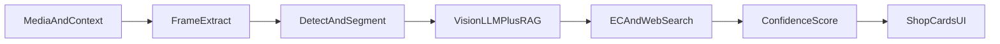

# Oshi Item Finder — 仕様整理ブリーフ

| 項目 | 内容 |
|------|------|
| 作業名（仮） | **Oshi Item Finder** |
| 一言 | 動画URL/フレーム → 着用アイテム特定 → 確証度付き購入導線 |
| 文書種別 | 新規事業仕様整理（実装コードは含まない） |
| バージョン | v0.1 |

---

## 1. 類似・競合既存サービスの調査とギャップ分析

### 1.1 競合比較

| サービス名 | アプローチ手法 | 主なターゲット | 強み | 現状のペイン・弱点 |
|------------|----------------|----------------|------|-------------------|
| コレカウ | 有名人衣装の人手/編集DB。タレント名・番組名検索。販売サイトへ誘導 | ドラマ/バラエティ/SNS私服を追う国内ファン | TV衣装協力・ファッションハンターによる特定。無地アイテムにも強い。累計ユーザー規模大 | 任意のYouTube/TikTok/配信の「その秒」リアルタイム特定は弱い。未掲載は質問待ち |
| WEAR | コーデ投稿＋ZOZOTOWN在庫連携の画像/コーデ検索 | 国内ファスト〜ドメスティック志向の一般ユーザー | 数百万点級の正規商品DB直結。在庫・実売価格の即時確認 | 推しコンテキストなし。スクショ工程が残る。有名人の未タグ私服には非特化 |
| LTK（LikeToKnowIt） | クリエイターが商品をタグ付けしたショッパブル投稿/動画 | 海外中心のインフルエンサーフォロワー | 100万ブランド超のタグ基盤。コミッション比較・ショップ統合 | 本人/ブランドがタグした商品のみ。未タグ私服は対象外。国内推し活文脈は薄い |
| YouTube Shopping | クリエイター/ブランドが動画・Shorts・配信に商品タグ | YouTube視聴者・レビュー志向バイヤー | 長尺コンテンツ内のタグ。Merchant Center連携 | タグ必須。日本含む地域制限あり。ファンカム等非公式映像は対象外 |
| TikTok Shop | アプリ内完結の商品タグ＋チェックアウト | 衝動買い・トレンド消費層 | 低摩擦の購入体験。ライブコマース親和性 | タグ済み商品のみ。未開示の私服特定には使えない |
| Google Lens | Web全体の画像照合 | 汎用「これ何？」ユーザー | 柄物・特徴ディテールで高精度。無料・網羅性 | 推しコンテキストなし。一時停止→スクショが必須。無地・暗所・動きで精度低下 |
| ZOZOTOWN 画像検索 | ECモール内の類似商品検索 | 国内ですぐ買いたいユーザー | 掲載ブランド数が多い。購入まで一気通貫 | モール内に閉じる。完全一致より類似寄り。推しのシーン文脈なし |
| 抖音 / 淘宝ライブ系 | ライブ内ネイティブカート＋アフィリ（淘宝客等） | 中国ライブコマース消費者 | 発見→購入がアプリ内完結。高GMV | タグ/カート前提。日本の推し活（未タグファンカム）課題とは別構造 |

### 1.2 既存が満たし切れていない「推し活ユーザー特有の課題」

1. **工程の離脱**: 一時停止 → スクショ → レンズ/画像検索の手数が多い  
2. **動的被写体の失敗**: 斜め・動き・低解像度・スポットライト反射で汎用Lensが外れる  
3. **欲求の二系統**: 「本人完全一致」と「プチプラ概念コーデ」を同時に欲しい  
4. **非公式映像**: 配信・推しカメラ・ファンカムなど、タグも衣装DBもない素材が本体  

### 1.3 新規参入の勝ち筋（差別化）

**任意動画の任意秒**から、出演者コンテキスト＋ファン集合知＋マルチフレーム照合で**未タグアイテム**を特定し、**完全一致 / 同一ブランド / 類似（プチプラ含む）**を確証度付きで同時提示する。

| 差別化軸 | 内容 |
|----------|------|
| 入力 | URL＋タイムスタンプ（スクショ不要を目指す） |
| コンテキスト | 出演者名固定＋過去着用・スポンサー・ファン特定ログのRAG |
| 出力 | 確証度の可視化＋公式/モール/代替の並列導線 |
| 対象 | タグされていない私服・舞台袖・空港・VLOGまで |

---

## 2. エージェントへインプットする情報（Input）

### 2.1 メディアデータ

| 項目 | 例 / 備考 |
|------|-----------|
| 動画URL | YouTube / TikTok / その他公開ページ |
| 開始・終了秒 | ユーザー指定の注目区間 |
| キーフレーム群 | 自動抽出した代表フレーム（複数角度） |
| ユーザー切り抜き | アプリ内クロップ、またはアップロード静止画 |
| ライブURL＋オフセット | 配信中/アーカイブの相対時刻 |
| ブラウザ拡張DOMメタ | タイトル、チャンネル名、現在再生位置、og画像 |

**利用技術例**: yt-dlp / 公式Data API、ffmpeg（シーン検出・キーフレーム）、拡張は content script で `currentTime` 取得

### 2.2 コンテキスト情報

| 項目 | 例 / 備考 |
|------|-----------|
| 出演者名 | 必須に近い（例: NMIXX ベイ）。未指定時は顔認識候補を提示 |
| グループ名 | 照合用（過去着用DBのキー） |
| 番組・配信タイトル | クレジット・衣装協力の検索手がかり |
| 投稿日時 | シーズン・発売時期の絞り込み |
| 概要欄のタイアップ表記 | スポンサードの明示があれば優先仮説 |
| ハッシュタグ | `#協賛` `#PR` `#着用` 等 |
| 字幕 / 音声テキスト | 「このリップ〜」等の自己言及 |

### 2.3 ユーザー側の希望条件

| 項目 | 選択肢例 |
|------|----------|
| 一致レベル | 本人完全一致 / 同一ブランド / 類似デザイン / プチプラ代替（概念コーデ） |
| 予算制限 | 上限金額（円） |
| カテゴリ絞り込み | トップス、シューズ、ネックレス、リップ等 |
| 調達条件 | 国内即納優先、公式のみ、中古可、完売時は類似のみでよい |
| 件数 | 候補の最大件数（デフォルト3） |

---

## 3. AIエージェントの作業手順・ワークフロー（Agent Steps）

### 3.1 全体フロー



### 3.2 ステップ詳細

#### Step 1. メディア前処理・フレーム抽出

- URL解決 → 動画取得（yt-dlp / 公式API）  
- ffmpeg でキーフレーム抽出、シーン検出  
- 人物トラッキング（MediaPipe / YOLO）で対象出演者の写っている区間を優先  
- **出力**: 正規化フレーム画像セット＋タイムスタンプ

#### Step 2. 物体検出・セグメンテーション

- ファッション特化検出（トップス / アウター / シューズ / ジュエリー / コスメ等）  
- SAM系でインスタンス切出し  
- ユーザー指定カテゴリがあればそのクラスを優先  
- **出力**: カテゴリ付きクロップ画像

#### Step 3. マルチモーダル解析・コンテキスト照合

- Vision LLM（GPT-4o / Gemini 等）で形状・色・質感・意匠を言語化  
- 出演者の過去着用DB・スポンサー情報・ファン特定投稿（X / Reddit / 専用Wiki）をRAG照合  
- **中間出力契約**: 下記JSONスキーマ（鑑定プロンプト資産）

```json
{
  "item_detected": true,
  "visual_features": {
    "category": "{{target_category}}",
    "primary_color": "詳細な色名",
    "materials_texture": "素材感の推測",
    "distinctive_marks": "ステッチ・刻印・ロゴ配置などの固有デザイン"
  },
  "candidate_brands": [
    {
      "brand_name": "ブランド名",
      "model_candidate": "推測される商品名または型番",
      "confidence_rationale": "視覚的・コンテキスト的根拠"
    }
  ],
  "search_queries": [
    "English brand + feature query",
    "日本語 タレント名 + アイテム特徴"
  ]
}
```

- 候補ブランドは最大3件を目安に仮説構築（過去嗜好・タイアップを加味）

#### Step 4. EC・データベース横断検索

- 画像検索: Google Lens API相当、Pinterest、自前ベクトル類似  
- テキスト検索: `search_queries` で楽天 / Amazon / ZOZO / 公式EC  
- アフィリエイト: もしもアフィリエイト / A8 等でトラッキングURL生成（契約後）  
- **出力**: 同一商品候補＋類似・プチプラ候補のURL集合

#### Step 5. 信頼度スコアリングと結果検証

| 確証度 | 意味 | 判定例 |
|--------|------|--------|
| `exact` | 完全一致 | 複数フレーム＋ラベル/形状＋外部ソース一致 |
| `same_brand` | 同一ブランド | ブランドまでは有力、型番は保留 |
| `similar` | 類似デザイン | シルエット・色味近似。代替提案向き |

- 根拠フィールド: フレーム一致度、テキスト証拠、複数ソース一致数  
- 閾値未満は `needs_review`（要確認）として提示し、断定しない  
- **出力**: スコア付きアイテムカード用ペイロード（§4）

### 3.3 技術スタック例（実現性）

| 領域 | 例 |
|------|-----|
| 取得・前処理 | yt-dlp, ffmpeg, 公式 YouTube Data API |
| 検出 | YOLO / ファッション特化検出器, SAM / SAM2 |
| 人物 | MediaPipe Face/Pose |
| 言語化・照合 | GPT-4o / Gemini, 埋め込み＋ベクトルDB（pgvector等） |
| 検索 | SerpAPI / Lens相当, 各EC検索API, アフィリエイトASP |
| アプリ | Next.js Web（結果画面MVP）→ 拡張機能は後続 |

---

## 4. 出力情報（Output）

### 4.1 ユーザー向け画面（カード）

| ブロック | 表示項目 |
|----------|----------|
| アイテム | ブランド名、商品名、型番候補、定価/価格帯、カテゴリ、切り抜きサムネ、動画内タイムスタンプ |
| 購入導線 | 公式EC、モール型EC、在庫概況（あれば）、アフィリエイトリンク |
| 推し活拡張 | 着用シーン説明、同一推しの過去着用回数（DB接続後）、プチプラ代替、概念コーデ提案 |
| 確証度 | バッジ（完全一致 / 同一ブランド / 類似）＋根拠テキスト |

### 4.2 APIレスポンス案（MVP）

```json
{
  "request_id": "uuid",
  "celebrity": "出演者名",
  "timestamp": "00:48",
  "focus_category": "アウター",
  "items": [
    {
      "brand_name": "string",
      "product_name": "string",
      "model_candidate": "string",
      "list_price_hint": "string",
      "category": "string",
      "thumbnail_url": "string",
      "confidence": "exact | same_brand | similar | needs_review",
      "confidence_note": "string",
      "purchase_links": [
        {
          "label": "公式",
          "url": "string",
          "kind": "official | mall | affiliate",
          "stock_hint": "in_stock | unknown | sold_out"
        }
      ],
      "alternatives": [
        {
          "label": "プチプラ代替名",
          "price_hint": "string",
          "note": "概念コーデ用の説明"
        }
      ],
      "oshi_meta": {
        "scene_note": "string",
        "past_wear_count": null
      }
    }
  ],
  "search_queries_used": ["string"]
}
```

### 4.3 UX上の注意

- 確証度が低い候補は「推測」と明示し、誤購入リスクを下げる  
- 完全一致が取れない場合でも、類似＋プチプラで「今日のコーデ再現」を止めない  
- タイムスタンプと切り抜きを併記し、どの秒の話か常に分かるようにする  

---

## 5. MVPスコープ（実装は次フェーズ）

本ブリーフは仕様整理まで。実装時の初期スコープ案:

1. **入力**: YouTube URL + タイムスタンプ + 出演者名 → トップスまたはアクセ **1カテゴリ** 特定  
2. **出力**: 候補最大3件 + 確証度 + 検索クエリ/購入リンク  
3. **UI**: Webアプリの結果画面のみ（ブラウザ拡張・ライブ連携は後続）  
4. **データ**: 初期は限定出演者（例: 検証用に1名）のモック/半自動でも可。本番エージェント接続は段階導入  

### スコープ外（当面）

- 本番アフィリエイト契約・在庫APIの全モール網羅  
- Note/SNSへの自動投稿  
- 課金デプロイの本番公開判断  

### 成功指標（案）

| 指標 | 目安 |
|------|------|
| 特定フロー完了率 | スクショ従来比で手順数を半減できるUXか（定性＋計測） |
| 候補提示率 | リクエストのX%以上で1件以上の候補を返す |
| 確証度キャリブレーション | `exact` 表示のうち事後検証で過半数以上が妥当（人手サンプル） |

---

## 関連

- フロント感触検証の先行試作: `bae-looks`（NMIXX ベイ特化UI）がある場合、同一の確証度・カード設計を本サービスのUI骨格候補として再利用可能  
- 鑑定中間JSONは本ブリーフ §3.2 Step 3 を正とする  
