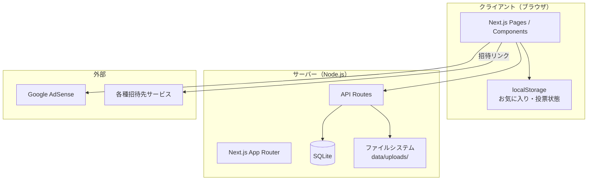
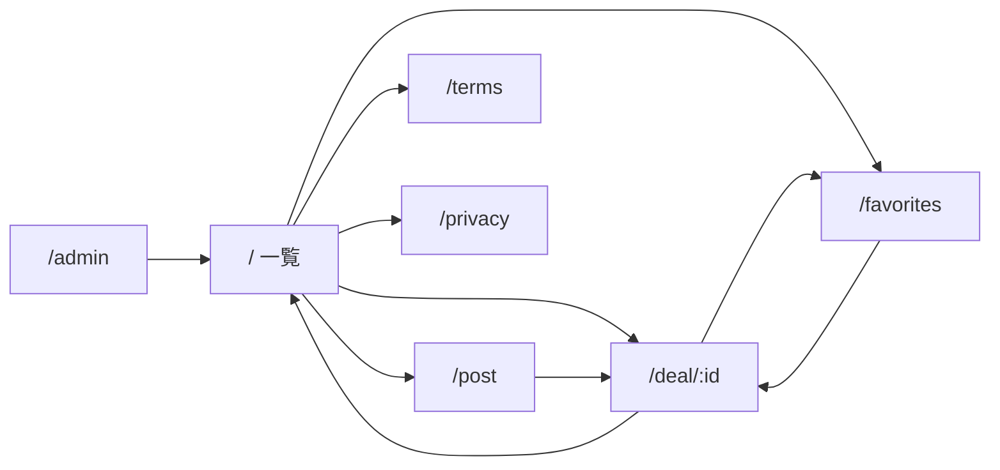
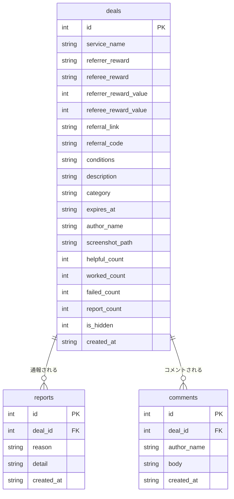

# 招待みんなでショータイム 基本設計書 v1.0

## ドキュメント構成

| ドキュメント | 役割 |
|-------------|------|
| [REQUIREMENTS.md](./REQUIREMENTS.md) | 要件定義（What：何を作るか） |
| **BASIC_DESIGN.md（本書）** | 基本設計（How：どう作るか） |
| [DETAILED_DESIGN.md](./DETAILED_DESIGN.md) | 詳細設計（How：具体仕様） |

---

## 1. システム概要

### 1.1 目的

ロケットなう系の**紹介・招待キャンペーン**をユーザーが投稿・閲覧できる掲示板 Web アプリケーション。紹介者特典・被紹介者特典の双方を掲載し、誰でも自分の招待リンクを共有できる。

### 1.2 利用者

| 利用者 | 役割 |
|--------|------|
| 一般ユーザー | 案件の閲覧・検索・投稿・コメント・通報 |
| 運営者 | 管理画面でのモデレーション |

### 1.3 確定方針（要件定義 v1.2 より）

- 会員登録なし（匿名投稿可）
- 同一サービスの複数投稿 OK
- 期限切れ案件は自動非表示
- 通報 3 件で自動非表示
- スクリーンショットは推奨（任意）
- 広告掲載あり
- 利用規約・プライバシーポリシーを公開

---

## 2. システム構成



### 2.1 技術スタック

| 層 | 技術 |
|----|------|
| フロントエンド | Next.js 16（App Router）、React 19、TypeScript |
| スタイリング | Tailwind CSS 4 |
| バックエンド | Next.js API Routes（Node.js ランタイム） |
| DB | SQLite（better-sqlite3） |
| ファイル保存 | ローカル `data/uploads/` |
| 広告 | Google AdSense（環境変数で有効化） |
| ホスティング想定 | Vercel 等 |

### 2.2 ディレクトリ構成

```
coupon-board/
├── src/
│   ├── app/              # ページ・API ルート
│   │   ├── api/          # REST API
│   │   ├── deal/[id]/    # 案件詳細
│   │   ├── post/         # 投稿
│   │   ├── favorites/    # お気に入り
│   │   ├── admin/        # 管理画面
│   │   ├── terms/        # 利用規約
│   │   └── privacy/      # プライバシーポリシー
│   ├── components/       # UI コンポーネント
│   └── lib/              # DB・認証・ユーティリティ
├── data/                 # SQLite・画像（gitignore）
├── REQUIREMENTS.md       # 要件定義
└── BASIC_DESIGN.md       # 本書
```

---

## 3. 機能設計

### 3.1 機能一覧

| ID | 機能 | 説明 | 認証 |
|----|------|------|------|
| F01 | 案件一覧 | 新着・人気・特典順、カテゴリ・検索 | 不要 |
| F02 | 案件詳細 | 特典・スクショ・リンク・コード表示 | 不要 |
| F03 | 案件投稿 | 招待情報の新規投稿（即時公開） | 不要 |
| F04 | スクリーンショット | 投稿時の画像添付（推奨） | 不要 |
| F05 | 役に立った | 詳細ページでの評価 | 不要 |
| F06 | 使えた報告 | 使えた / 使えなかった の投票 | 不要 |
| F07 | コメント | 案件へのコメント投稿・表示 | 不要 |
| F08 | お気に入り | 案件のブラウザ保存・一覧 | 不要 |
| F09 | 通報 | 不適切案件の通報 | 不要 |
| F10 | 管理画面 | 案件管理・通報確認 | パスワード |
| F11 | 広告表示 | 一覧・詳細への広告枠 | 不要 |
| F12 | 利用規約 | 法的ページ表示 | 不要 |
| F13 | プライバシーポリシー | 法的ページ表示 | 不要 |

### 3.2 画面一覧

| パス | 画面名 | 主な機能 |
|------|--------|----------|
| `/` | トップ（一覧） | F01, F11 |
| `/deal/[id]` | 案件詳細 | F02, F05〜F09, F11 |
| `/post` | 投稿 | F03, F04 |
| `/favorites` | お気に入り | F08 |
| `/admin` | 管理画面 | F10 |
| `/terms` | 利用規約 | F12 |
| `/privacy` | プライバシーポリシー | F13 |

### 3.3 画面遷移



---

## 4. データベース設計

### 4.1 ER 概要



### 4.2 テーブル定義

#### deals（案件）

| カラム | 型 | 説明 |
|--------|-----|------|
| id | INTEGER PK | 自動採番 |
| service_name | TEXT | サービス名（必須） |
| referrer_reward | TEXT | 紹介者特典（必須） |
| referee_reward | TEXT | 被紹介者特典（必須） |
| referrer_reward_value | INTEGER | 並び替え用金額（任意） |
| referee_reward_value | INTEGER | 並び替え用金額（任意） |
| referral_link | TEXT | 招待 URL |
| referral_code | TEXT | 招待コード |
| conditions | TEXT | 利用条件 |
| description | TEXT | 補足 |
| category | TEXT | カテゴリ |
| expires_at | TEXT | 期限（YYYY-MM-DD） |
| author_name | TEXT | 投稿者名 |
| screenshot_path | TEXT | 画像ファイル名 |
| helpful_count | INTEGER | 役に立った数 |
| worked_count | INTEGER | 使えた報告数 |
| failed_count | INTEGER | 使えなかった報告数 |
| report_count | INTEGER | 通報数 |
| is_hidden | INTEGER | 0=公開, 1=非表示 |
| created_at | TEXT | 投稿日時 |

**公開条件:** `is_hidden = 0` かつ（`expires_at IS NULL` または `expires_at >= 今日`）

#### reports（通報）

| カラム | 型 | 説明 |
|--------|-----|------|
| id | INTEGER PK | 自動採番 |
| deal_id | INTEGER FK | 対象案件 |
| reason | TEXT | expired / false_info / scam / spam / other |
| detail | TEXT | 補足 |
| created_at | TEXT | 通報日時 |

**自動非表示:** `report_count >= 3` で `is_hidden = 1`

#### comments（コメント）

| カラム | 型 | 説明 |
|--------|-----|------|
| id | INTEGER PK | 自動採番 |
| deal_id | INTEGER FK | 対象案件 |
| author_name | TEXT | 投稿者名 |
| body | TEXT | 本文 |
| created_at | TEXT | 投稿日時 |

### 4.3 カテゴリ一覧

| value | 表示名 |
|-------|--------|
| payment | 決済・送金 |
| ec | EC・通販 |
| finance | 金融 |
| subscription | サブスク |
| point | ポイ活・アプリ |
| sidejob | 副業・仕事 |
| other | その他 |

### 4.4 クライアント保存（localStorage）

| キー | 内容 |
|------|------|
| `shotime_favorites` | お気に入り案件 ID 配列 |
| `usage_{dealId}` | 使えた/使えなかった 投票済み状態 |

---

## 5. API 設計

### 5.1 公開 API

| メソッド | パス | 説明 |
|----------|------|------|
| GET | `/api/deals` | 案件一覧（`category`, `search`, `sort`, `ids`） |
| POST | `/api/deals` | 案件投稿（JSON または multipart） |
| GET | `/api/deals/[id]` | 案件取得 |
| PATCH | `/api/deals/[id]` | 役に立った +1 |
| POST | `/api/deals/[id]/report` | 通報 |
| POST | `/api/deals/[id]/usage` | 使えた/使えなかった（`type: worked \| failed`） |
| GET | `/api/deals/[id]/comments` | コメント一覧 |
| POST | `/api/deals/[id]/comments` | コメント投稿 |
| GET | `/api/uploads/[filename]` | スクリーンショット配信 |

**sort パラメータ:** `new` | `popular` | `referrer` | `referee`

### 5.2 管理 API（要認証 Cookie）

| メソッド | パス | 説明 |
|----------|------|------|
| POST | `/api/admin/login` | ログイン |
| DELETE | `/api/admin/login` | ログアウト |
| GET | `/api/admin` | 全案件・通報一覧 |
| PATCH | `/api/admin/deals/[id]` | `hide` / `unhide` / `delete` |

### 5.3 投稿バリデーション

| 項目 | ルール |
|------|--------|
| service_name | 必須 |
| referrer_reward | 必須 |
| referee_reward | 必須 |
| referral_link / referral_code | どちらか必須 |
| screenshot | 任意（JPEG/PNG/WebP、5MB 以下） |

---

## 6. ファイル設計

### 6.1 スクリーンショット

| 項目 | 内容 |
|------|------|
| 保存先 | `data/uploads/` |
| ファイル名 | `{timestamp}-{random}.{ext}` |
| 配信 | `/api/uploads/[filename]` |
| 許可形式 | image/jpeg, image/png, image/webp |

---

## 7. 認証・セキュリティ設計

### 7.1 管理画面認証

- 方式: パスワード + HttpOnly Cookie（SHA-256 トークン）
- パスワード: 環境変数 `ADMIN_PASSWORD`
- 有効期限: 7 日

### 7.2 セキュリティ対策

| 対策 | 内容 |
|------|------|
| 通報による自動非表示 | 3 件で非表示 |
| 期限切れ自動除外 | SQL フィルタ |
| ファイルパス | `path.basename` でディレクトリトラバーサル防止 |
| 外部リンク | `rel="noopener noreferrer"` |
| 投稿同意 | 利用規約への同意文言表示 |

### 7.3 未実装（Phase 2）

- 会員認証・CSRF トークン
- レートリミット（投稿・通報）
- 重複リンク検出

---

## 8. 非機能要件

| 項目 | 方針 |
|------|------|
| 対応端末 | スマホ優先、PC 対応 |
| 言語 | 日本語のみ |
| データ規模 | 小〜中規模（SQLite 想定） |
| 可用性 | ベストエフォート（個人・小規模運用想定） |

---

## 9. 収益化・法的設計

### 9.1 広告

- コンポーネント: `AdSlot`
- 配置: 一覧（inline）、詳細（top / bottom）
- 有効化: `NEXT_PUBLIC_ADSENSE_CLIENT_ID` 設定時

### 9.2 法的ページ

| パス | 内容 |
|------|------|
| `/terms` | 利用規約（投稿ルール、免責、広告） |
| `/privacy` | プライバシーポリシー（収集情報、AdSense、localStorage） |

運営者情報は環境変数で設定:

```
NEXT_PUBLIC_OPERATOR_NAME
NEXT_PUBLIC_CONTACT_EMAIL
```

---

## 10. 環境変数

| 変数名 | 必須 | 説明 |
|--------|------|------|
| `ADMIN_PASSWORD` | 推奨 | 管理画面パスワード |
| `NEXT_PUBLIC_OPERATOR_NAME` | 任意 | 運営者名（法的ページ） |
| `NEXT_PUBLIC_CONTACT_EMAIL` | 任意 | 問い合わせメール |
| `NEXT_PUBLIC_ADSENSE_CLIENT_ID` | 任意 | AdSense クライアント ID |
| `NEXT_PUBLIC_ADSENSE_SLOT` | 任意 | AdSense スロット ID |

---

## 11. 運用・デプロイ

### 11.1 起動

```bash
cd coupon-board
npm install
npm run dev    # 開発
npm run build && npm start  # 本番
```

### 11.2 データ永続化

- `data/` ディレクトリに DB・画像を保存
- Vercel 等のサーバーレスでは `data/` が永続化されないため、本番は以下いずれかが必要:
  - 永続ディスク付き VPS
  - 外部 DB（Turso / PlanetScale 等）への移行
  - 画像を S3 等オブジェクトストレージへ移行

### 11.3 バックアップ

- `data/coupons.db` と `data/uploads/` を定期バックアップ

---

## 12. Phase 2（将来拡張）

| 項目 | 内容 |
|------|------|
| 会員登録・ログイン | お気に入りのクラウド同期 |
| 投稿編集・削除 | ユーザー自身による管理 |
| レートリミット | スパム対策 |
| 外部 DB / ストレージ | スケール対応 |
| プッシュ通知 | 新着案件通知 |
| 利用規約の法務レビュー | 本番前の専門家確認 |

---

## 改訂履歴

| 版 | 日付 | 内容 |
|----|------|------|
| v1.0 | 2026-06-30 | 初版作成（要件 v1.2 を反映） |
