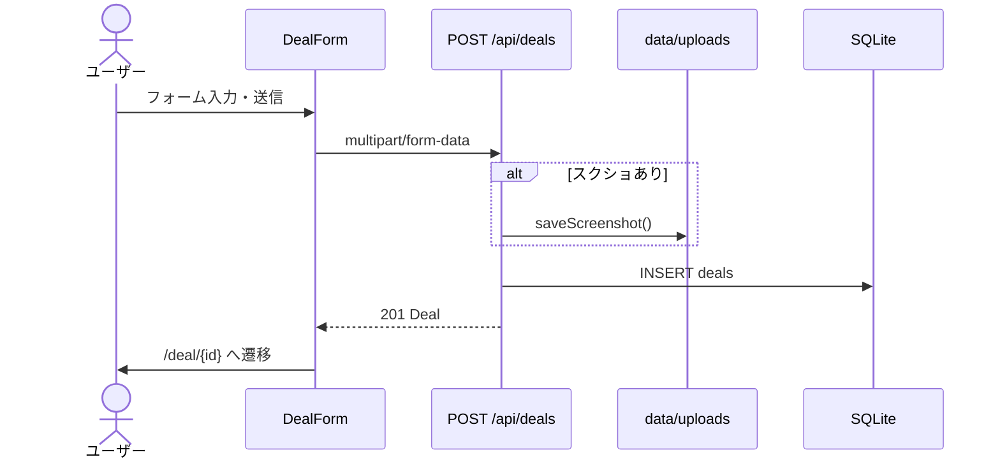
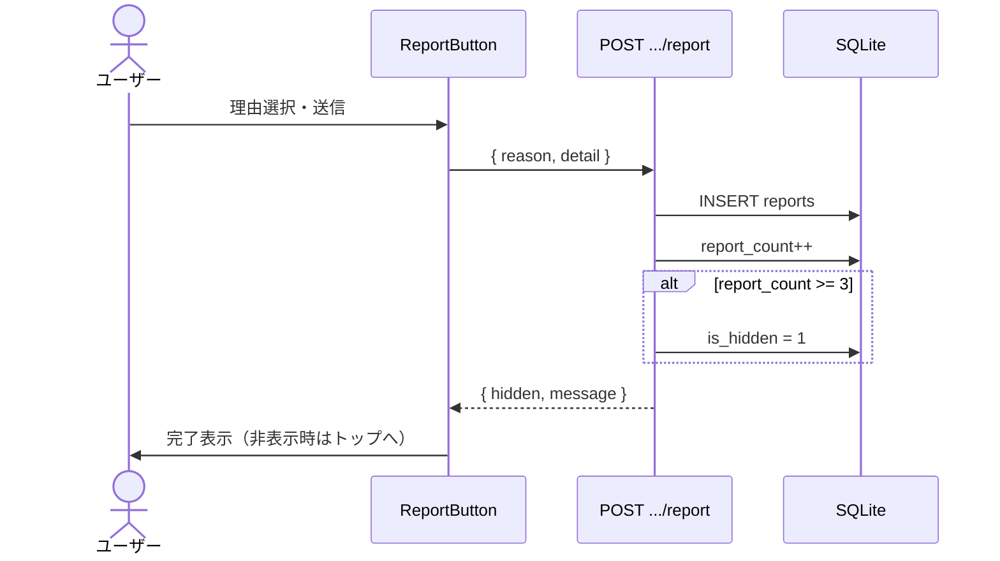
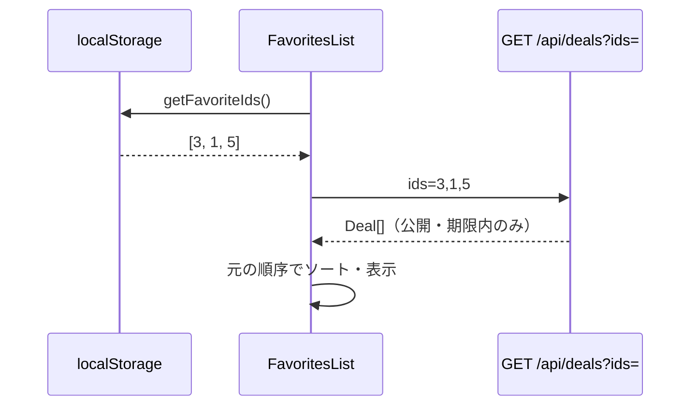

# 招待みんなでショータイム 詳細設計書 v1.0

## ドキュメント構成

| ドキュメント | 役割 |
|-------------|------|
| [REQUIREMENTS.md](./REQUIREMENTS.md) | 要件定義（What） |
| [BASIC_DESIGN.md](./BASIC_DESIGN.md) | 基本設計（How 概要） |
| **DETAILED_DESIGN.md（本書）** | 詳細設計（How 具体） |

---

## 1. 型定義

### 1.1 ドメイン型（`src/lib/types.ts`）

```typescript
type Category = "payment" | "ec" | "finance" | "subscription" | "point" | "sidejob" | "other"
type SortOption = "new" | "popular" | "referrer" | "referee"
type ReportReason = "expired" | "false_info" | "scam" | "spam" | "other"
type UsageType = "worked" | "failed"
```

### 1.2 Deal（案件）

| フィールド | 型 | 説明 |
|-----------|-----|------|
| id | number | 主キー |
| service_name | string | サービス名 |
| referrer_reward | string | 紹介者特典（表示用テキスト） |
| referee_reward | string | 被紹介者特典（表示用テキスト） |
| referrer_reward_value | number \| null | 並び替え用数値 |
| referee_reward_value | number \| null | 並び替え用数値 |
| referral_link | string \| null | 招待 URL |
| referral_code | string \| null | 招待コード |
| conditions | string | 利用条件 |
| description | string | 補足 |
| category | Category | カテゴリ |
| expires_at | string \| null | 期限 `YYYY-MM-DD` |
| author_name | string | 投稿者名（空なら「匿名」） |
| screenshot_path | string \| null | 画像ファイル名 |
| helpful_count | number | 役に立った数 |
| worked_count | number | 使えた報告数 |
| failed_count | number | 使えなかった報告数 |
| report_count | number | 通報数 |
| is_hidden | number | 0=公開, 1=非表示 |
| created_at | string | `YYYY-MM-DD HH:mm:ss`（ローカル） |

---

## 2. 画面詳細設計

### 2.1 トップ `/`（Server Component）

**ファイル:** `src/app/page.tsx`

| ブロック | コンポーネント | 説明 |
|----------|---------------|------|
| ヘッダー | `Header` | 全ページ共通 |
| ヒーロー | インライン | キャッチコピー、件数、利用規約リンク |
| 広告 | `AdSlot(position="inline")` | 一覧上部 |
| 検索・フィルター | `SearchFilter` | Client、Suspense でラップ |
| 案件グリッド | `DealCard` × N | 2 列（sm 以上） |

**クエリパラメータ（SearchFilter が操作）:**

| パラメータ | 値 | デフォルト |
|-----------|-----|-----------|
| category | Category value | なし（全件） |
| search | 文字列 | なし |
| sort | SortOption | `new` |

**空状態:** 該当 0 件時に点線枠 + 案内文を表示。

---

### 2.2 案件詳細 `/deal/[id]`（Server Component + Client 子）

**ファイル:** `src/app/deal/[id]/page.tsx`

| 順序 | UI 要素 | 種別 |
|------|---------|------|
| 1 | 戻るリンク | Server |
| 2 | 広告 top | `AdSlot` |
| 3 | カテゴリバッジ・サービス名 | Server |
| 4 | スクリーンショット or 未添付注意 | Server |
| 5 | 紹介者/被紹介者特典カード | Server |
| 6 | 招待コード表示 | Server |
| 7 | 利用条件・補足 | Server |
| 8 | 使えた報告 | `UsageReportButtons` |
| 9 | メタ情報（期限・投稿者・日時） | Server |
| 10 | CTA 群 | リンク開く / `CopyCodeButton` / `FavoriteButton` / `HelpfulButton` |
| 11 | コメント | `CommentSection` |
| 12 | 通報 | `ReportButton` |
| 13 | 広告 bottom | `AdSlot` |

**404 条件:** `getDealById(id)` が undefined（非表示・期限切れ・不存在）

---

### 2.3 投稿 `/post`（Server + `DealForm`）

**ファイル:** `src/app/post/page.tsx`, `src/components/DealForm.tsx`

| フィールド | UI | 必須 | 備考 |
|-----------|-----|------|------|
| service_name | text | ○ | |
| referrer_reward | text | ○ | |
| referee_reward | text | ○ | |
| referrer_reward_value | number | | 並び替え用 |
| referee_reward_value | number | | 並び替え用 |
| referral_link | url | △ | コードとどちらか |
| referral_code | text | △ | リンクとどちらか |
| screenshot | file | | **推奨**バッジ付き |
| category | select | ○ | |
| conditions | textarea | | |
| expires_at | date | | |
| description | textarea | | |
| author_name | text | | 空→匿名 |

**送信:** `multipart/form-data`（`FormData`）  
**成功時:** `/deal/{id}` へ `router.push` + `refresh`

---

### 2.4 お気に入り `/favorites`

**ファイル:** `src/app/favorites/page.tsx`, `FavoritesList`

| 状態 | 表示 |
|------|------|
| 読込中 | スケルトン |
| ID 0 件 | 空状態 + トップへのリンク |
| ID あり・案件 0 件 | 期限切れ/非表示メッセージ |
| 案件あり | `DealCard` グリッド |

**データ取得:** `GET /api/deals?ids=1,2,3`（localStorage の順序を維持）

---

### 2.5 管理画面 `/admin`

**ファイル:** `src/app/admin/page.tsx`, `AdminDashboard`

| 状態 | 表示 |
|------|------|
| 未認証 | パスワードフォーム |
| 認証済 | 通報一覧（最新 10 件）+ 全案件テーブル |

**操作:** 見る / 非表示 / 復活 / 削除（削除は confirm）

---

### 2.6 法的ページ `/terms`, `/privacy`

**ファイル:** `src/app/terms/page.tsx`, `src/app/privacy/page.tsx`  
**共通レイアウト:** `LegalDocument`, `LegalSection`

---

## 3. コンポーネント設計

### 3.1 コンポーネント一覧

| コンポーネント | 種別 | ファイル | 責務 |
|---------------|------|----------|------|
| Header / Footer | Server | `Header.tsx` | ナビ、法的リンク |
| DealCard | Server | `DealCard.tsx` | 一覧カード、サムネ表示 |
| DealForm | Client | `DealForm.tsx` | 投稿フォーム |
| SearchFilter | Client | `SearchFilter.tsx` | URL クエリ操作 |
| HelpfulButton | Client | `HelpfulButton.tsx` | 役に立った +1 |
| UsageReportButtons | Client | `UsageReportButtons.tsx` | 使えた/使えなかった |
| FavoriteButton | Client | `FavoriteButton.tsx` | localStorage お気に入り |
| FavoritesList | Client | `FavoritesList.tsx` | お気に入り一覧取得 |
| CommentSection | Client | `CommentSection.tsx` | コメント CRUD（Read+Create） |
| ReportButton | Client | `ReportButton.tsx` | 通報モーダル |
| CopyCodeButton | Client | `CopyCodeButton.tsx` | クリップボードコピー |
| AdSlot | Server | `AdSlot.tsx` | 広告 or プレースホルダ |
| AdminDashboard | Client | `AdminDashboard.tsx` | 管理 UI |
| LegalDocument | Server | `LegalDocument.tsx` | 法的ページ枠 |

### 3.2 Client コンポーネント Props

```typescript
// HelpfulButton
{ dealId: number; initialCount: number }

// UsageReportButtons
{ dealId: number; initialWorked: number; initialFailed: number }

// FavoriteButton
{ dealId: number }

// CommentSection
{ dealId: number }

// ReportButton
{ dealId: number }

// CopyCodeButton
{ code: string }

// DealCard
{ deal: Deal }

// AdSlot
{ position: "top" | "inline" | "bottom"; className?: string }
```

### 3.3 Client 状態管理

| 機能 | 保存先 | キー | 備考 |
|------|--------|------|------|
| お気に入り | localStorage | `shotime_favorites` | `number[]` JSON |
| 使えた投票 | localStorage | `usage_{dealId}` | `"worked"` \| `"failed"` |
| 役に立った | コンポーネント state | — | 再投票不可（セッション内） |
| 管理認証 | HttpOnly Cookie | `admin_session` | SHA-256 トークン |

---

## 4. API 詳細設計

### 4.1 共通

- **ランタイム:** `nodejs`（全 API Route）
- **Content-Type:** JSON または `multipart/form-data`（投稿のみ）
- **エラー形式:**

```json
{ "error": "エラーメッセージ" }
```

---

### 4.2 GET `/api/deals`

**クエリ:**

| パラメータ | 型 | 説明 |
|-----------|-----|------|
| category | string | カテゴリ絞り込み |
| search | string | LIKE 検索 |
| sort | SortOption | 並び順 |
| ids | string | カンマ区切り ID（お気に入り用） |

**レスポンス 200:**

```json
[
  {
    "id": 1,
    "service_name": "PayPay",
    "referrer_reward": "500円",
    "referee_reward": "500円",
    "referrer_reward_value": 500,
    "referee_reward_value": 500,
    "referral_link": "https://paypay.ne.jp/",
    "referral_code": null,
    "conditions": "新規登録が必要",
    "description": "",
    "category": "payment",
    "expires_at": null,
    "author_name": "匿名",
    "screenshot_path": null,
    "helpful_count": 0,
    "worked_count": 2,
    "failed_count": 0,
    "report_count": 0,
    "is_hidden": 0,
    "created_at": "2026-06-30 12:00:00"
  }
]
```

**フィルタロジック（SQL）:**

```sql
WHERE is_hidden = 0
  AND (expires_at IS NULL OR date(expires_at) >= date('now', 'localtime'))
```

---

### 4.3 POST `/api/deals`

**リクエスト（multipart）:**

| フィールド | 必須 |
|-----------|------|
| service_name | ○ |
| referrer_reward | ○ |
| referee_reward | ○ |
| referral_link または referral_code | △ どちらか |
| screenshot | ファイル（任意） |

**レスポンス 201:** Deal オブジェクト  
**エラー 400:** バリデーション、画像形式/サイズ  
**エラー 500:** サーバーエラー

---

### 4.4 GET `/api/deals/[id]`

| ステータス | 条件 |
|-----------|------|
| 200 | 公開中かつ期限内 |
| 404 | 非表示・期限切れ・不存在 |

---

### 4.5 PATCH `/api/deals/[id]`

**処理:** `helpful_count += 1`  
**レスポンス 200:** 更新後 Deal

---

### 4.6 POST `/api/deals/[id]/usage`

**リクエスト:**

```json
{ "type": "worked" }
```

| type | 処理 |
|------|------|
| worked | `worked_count += 1` |
| failed | `failed_count += 1` |

**レスポンス 200:**

```json
{ "worked_count": 3, "failed_count": 1 }
```

---

### 4.7 GET/POST `/api/deals/[id]/comments`

**GET 200:** `Comment[]`

**POST リクエスト:**

```json
{
  "body": "ちゃんと500円もらえました",
  "author_name": "ポイ活太郎"
}
```

**POST 201:** Comment オブジェクト  
**POST 400:** body 空  
**POST 404:** 案件なし

---

### 4.8 POST `/api/deals/[id]/report`

**リクエスト:**

```json
{
  "reason": "expired",
  "detail": "もう終わってました"
}
```

**reason 値:** `expired` | `false_info` | `scam` | `spam` | `other`

**レスポンス 200:**

```json
{
  "ok": true,
  "hidden": true,
  "message": "通報を受け付けました。この案件は非表示になりました。"
}
```

**副作用:**

1. `reports` に INSERT
2. `deals.report_count += 1`
3. `report_count >= 3` → `is_hidden = 1`

---

### 4.9 GET `/api/uploads/[filename]`

**レスポンス:** 画像バイナリ  
**Cache-Control:** `public, max-age=31536000, immutable`  
**404:** ファイル不存在

---

### 4.10 管理 API

#### POST `/api/admin/login`

```json
{ "password": "shotime-admin" }
```

**200:** `{ "ok": true }` + Set-Cookie  
**401:** パスワード不一致

#### DELETE `/api/admin/login`

**200:** Cookie 削除

#### GET `/api/admin`

**401:** 未認証  
**200:**

```json
{
  "deals": [ /* AdminDeal[] */ ],
  "reports": [ /* Report + service_name */ ]
}
```

#### PATCH `/api/admin/deals/[id]`

```json
{ "action": "hide" }
```

| action | 処理 |
|--------|------|
| hide | `is_hidden = 1` |
| unhide | `is_hidden = 0` |
| delete | comments, reports, deal を削除 |

---

## 5. 処理シーケンス

### 5.1 案件投稿



### 5.2 通報〜自動非表示



### 5.3 お気に入り表示



---

## 6. DB 操作詳細（`src/lib/db.ts`）

### 6.1 並び替え SQL

| sort | ORDER BY |
|------|----------|
| new | `created_at DESC` |
| popular | `helpful_count DESC, created_at DESC` |
| referrer | `referrer_reward_value DESC NULLS LAST, created_at DESC` |
| referee | `referee_reward_value DESC NULLS LAST, created_at DESC` |

### 6.2 検索対象カラム

`service_name`, `referrer_reward`, `referee_reward`, `referral_code`, `conditions`, `description`

### 6.3 シードデータ

初回起動時 `deals` テーブルが空の場合、5 件のサンプル案件を投入。

---

## 7. ファイルアップロード詳細（`src/lib/upload.ts`）

| 項目 | 値 |
|------|-----|
| 保存先 | `data/uploads/` |
| 最大サイズ | 5 MB |
| MIME | image/jpeg, image/png, image/webp |
| ファイル名 | `{timestamp}-{randomHex16}.{ext}` |
| URL 生成 | `src/lib/screenshot.ts` → `/api/uploads/{filename}` |

---

## 8. 認証詳細（`src/lib/admin.ts`）

```
sessionToken = SHA256(ADMIN_PASSWORD)
Cookie: admin_session = sessionToken
有効期限: 7日
httpOnly: true
secure: production のみ
sameSite: lax
```

---

## 9. エラーハンドリング一覧

| 画面/API | エラー | ユーザーへの表示 |
|----------|--------|-----------------|
| DealForm | 400 | フォーム上部に赤枠メッセージ |
| DealForm | ネットワーク | 「通信エラーが発生しました」 |
| ReportButton | 400/失敗 | モーダル内エラー |
| CommentSection | 400/失敗 | フォーム上エラー |
| 案件詳細 | 404 | `not-found.tsx` |
| AdminDashboard | 401 | ログインフォーム継続 |

---

## 10. 広告詳細（`AdSlot`）

| 条件 | 表示 |
|------|------|
| `NEXT_PUBLIC_ADSENSE_CLIENT_ID` 設定あり | `<ins class="adsbygoogle">` |
| 未設定 | 点線枠プレースホルダ「広告スペース」 |

| 配置 | ページ |
|------|--------|
| inline | トップ一覧上 |
| top / bottom | 案件詳細 |

---

## 11. 環境変数（再掲）

| 変数 | 参照箇所 |
|------|----------|
| ADMIN_PASSWORD | `lib/admin.ts` |
| NEXT_PUBLIC_OPERATOR_NAME | `LegalDocument.tsx`（terms/privacy） |
| NEXT_PUBLIC_CONTACT_EMAIL | 同上 |
| NEXT_PUBLIC_ADSENSE_CLIENT_ID | `AdSlot.tsx` |
| NEXT_PUBLIC_ADSENSE_SLOT | `AdSlot.tsx` |

---

## 12. テスト観点（手動）

| # | シナリオ | 期待結果 |
|---|----------|----------|
| 1 | 必須項目なしで投稿 | 400 エラー |
| 2 | スクショ付き投稿 | 詳細に画像表示 |
| 3 | 期限切れ案件 | 一覧・詳細に出ない |
| 4 | 通報 3 回 | 自動非表示 |
| 5 | 管理画面で復活 | 一覧に再表示 |
| 6 | お気に入り追加→/favorites | カード表示 |
| 7 | 使えた報告 2 回目 | ボタン disabled |
| 8 | 管理パスワード誤り | 401 |

---

## 13. Phase 2 で詳細設計が必要になる項目

- 会員登録 API・セッション設計
- レートリミット（IP ベース）
- 外部 DB マイグレーション手順
- S3 画像ストレージ移行

---

## 改訂履歴

| 版 | 日付 | 内容 |
|----|------|------|
| v1.0 | 2026-06-30 | 初版（実装 v1.2 準拠） |
