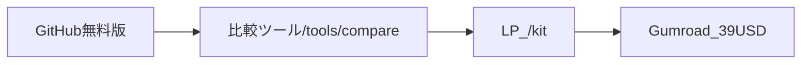

# 無料版 / 有料版 切り分け設計

## 方針

Open-coreモデル: GitHub無料版で信頼を獲得 → Gumroad有料版でフルキット販売。



## 無料版（GitHub公開）

**パス:** `ai-dashboard-kit/free/`

| 含む | 含まない |
|------|---------|
| 5社データ（OpenAI, Anthropic, DeepMind, Meta AI, Mistral） | 残り5社（Cohere, xAI, Perplexity, Stability, NVIDIA） |
| 関連モデル・調達・ニュース（5社分のみ） | 全10モデル |
| `schemas/types.ts`（型定義は公開） | `docs/COMPONENT_SPEC.md` |
| `README.md`（無料版） | `docs/REQUIREMENTS.md` |
| | `scripts/generate-claude-context.mjs` |
| | `CLAUDE.md`（フル版） |
| | `sales/QUICKSTART.md` |

**目的:** 「動くデモ」と「データ品質」の証明。実装の設計書と生成スクリプトは有料の核。

## 有料版（Gumroad $39）

**パス:** `ai-dashboard-kit/` 全体（`free/` を除くフルパッケージ）

| 内容 | ファイル |
|------|---------|
| 全10社シードデータ | `data/*.json` |
| TypeScript型定義 | `schemas/types.ts` |
| 要件定義書 | `docs/REQUIREMENTS.md` |
| コンポーネント仕様書 | `docs/COMPONENT_SPEC.md` |
| Claude/Cursor作業ガイド | `CLAUDE.md` |
| コンテキスト自動生成 | `scripts/generate-claude-context.mjs` |
| クイックスタート | `sales/QUICKSTART.md` |
| ライセンス | `LICENSE.md` |

**再配布:** 購入者は自分のプロダクトに組み込み可。キット自体の再販は不可。

## 価格ラダー

| ティア | 価格 | 内容 |
|--------|------|------|
| Free | $0 | GitHub 5社 + 比較ツール |
| Core | $39 | フルキット（買い切り） |
| Pro（将来） | $79 | Core + 追加ニッチキット（会話コーチゲーム等） |

## 更新手順

```bash
# 無料版データを再生成（本番データ変更時）
node ai-dashboard-kit/scripts/build-free-tier.mjs

# 有料版コンテキスト生成（購入者向け）
node ai-dashboard-kit/scripts/generate-claude-context.mjs
```
