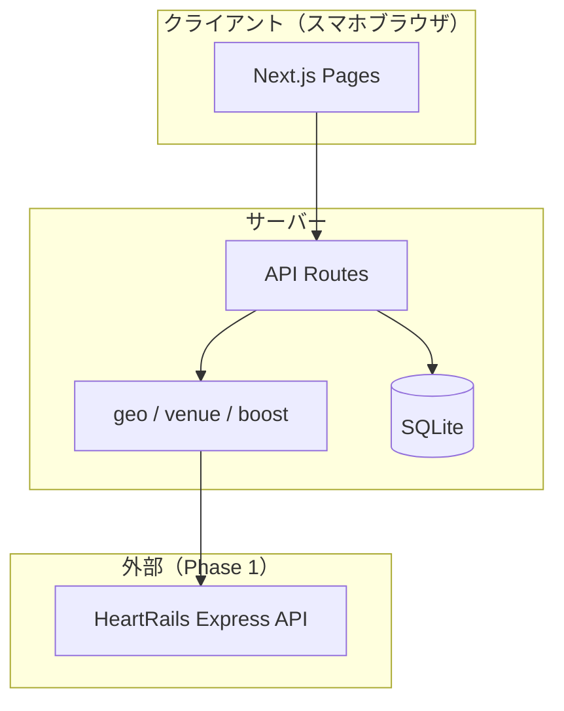

# 飲み会盛り上げAI 基本設計 v1.0

> 要件: [REQUIREMENTS.md](./REQUIREMENTS.md)

## システム構成

## 画面一覧

| パス | 説明 |
|------|------|
| `/` | トップ・サービス説明 |
| `/create` | イベント作成フォーム |
| `/e/[slug]` | イベント詳細・プラン表示・幹事操作 |
| `/e/[slug]/join` | 参加者入力フォーム |
| `/terms` | 利用規約 |
| `/privacy` | プライバシーポリシー |

## データモデル

- **events**: イベント本体（slug, edit_token, 予算, 雰囲気, 日時候補）
- **participants**: 参加者（名前, 最寄駅, 参加可能日時 JSON）
- **plans**: 生成プラン（中間駅, 店候補 JSON, 盛り上げ JSON）

## API

| Method | Path | 用途 |
|--------|------|------|
| POST | `/api/events` | イベント作成 |
| GET | `/api/events/[slug]` | イベント取得 |
| POST | `/api/events/[slug]/join` | 参加者追加 |
| POST | `/api/events/[slug]/plan` | プラン生成（edit_token 必須） |
| GET | `/api/health` | ヘルスチェック |
