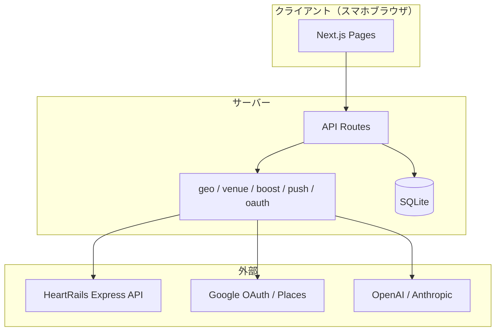

# 飲み会盛り上げAI 基本設計 v1.1

> 要件: [REQUIREMENTS.md](./REQUIREMENTS.md)

## システム構成

## 画面一覧

| パス | 説明 |
|------|------|
| `/` | トップ・サービス説明 |
| `/create` | イベント作成フォーム（想定参加人数） |
| `/e/[slug]` | イベント詳細・プラン表示・幹事操作 |
| `/e/[slug]/join` | 参加者入力フォーム |
| `/e/[slug]/edit` | 参加者の回答編集（participant_token） |
| `/login` | 幹事ログイン（メール / Google / LINE / Apple） |
| `/signup` | 幹事新規登録 |
| `/my` | マイページ（ログイン幹事のイベント一覧） |
| `/terms` | 利用規約 |
| `/privacy` | プライバシーポリシー |

## データモデル

- **users / sessions**: 幹事アカウント（任意ログイン、google_id / line_id / apple_id 対応）
- **events**: イベント本体（slug, edit_token, organizer_user_id, expires_at, expected_participant_count, all_answered_notified_at）
- **participants**: 参加者（名前, 最寄駅, participant_token）
- **plans**: 生成プラン（中間駅, 店候補 JSON, 盛り上げ JSON）
- **push_subscriptions**: 幹事向け（UNIQUE event_id + endpoint）
- **participant_push_subscriptions**: 参加者向け（UNIQUE participant_id + endpoint）

## API

| Method | Path | 用途 |
|--------|------|------|
| POST | `/api/events` | イベント作成 |
| GET | `/api/events/[slug]` | イベント取得 |
| POST | `/api/events/[slug]/join` | 参加者追加 |
| POST | `/api/events/[slug]/plan` | プラン生成（edit_token 必須） |
| POST | `/api/events/[slug]/clone` | イベント複製 |
| PUT | `/api/events/[slug]/participants/[id]` | 参加者更新（participant_token） |
| DELETE | `/api/events/[slug]/participants/[id]` | 参加者削除 |
| DELETE | `/api/events/[slug]` | イベント削除（edit_token） |
| GET/POST | `/api/push/subscribe` | Web Push 購読 |
| GET | `/api/auth/google` | Google OAuth 開始 |
| GET | `/api/auth/google/callback` | Google OAuth コールバック |
| GET | `/api/auth/line` | LINE OAuth 開始 |
| GET | `/api/auth/line/callback` | LINE OAuth コールバック |
| GET | `/api/auth/apple` | Apple Sign In 開始 |
| GET | `/api/auth/apple/callback` | Apple Sign In コールバック |
| GET | `/api/og/[slug]` | OGP 画像生成 |
| POST | `/api/auth/signup` | 幹事登録 |
| POST | `/api/auth/login` | ログイン |
| GET | `/api/auth/me` | セッション確認 |
| GET | `/api/health` | ヘルスチェック |
